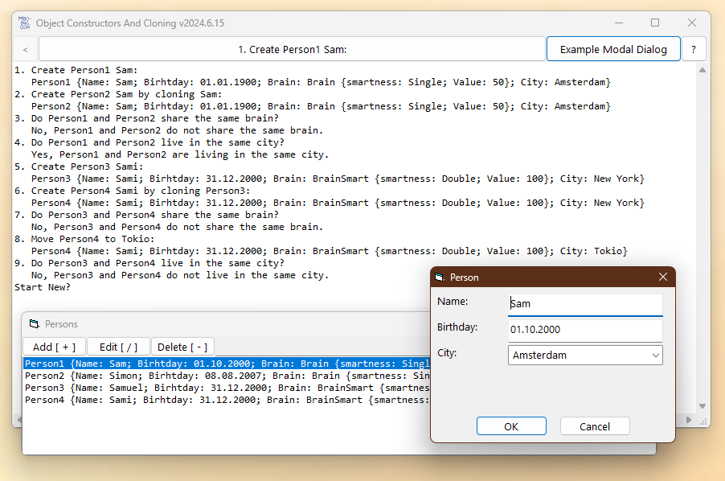

# OOP_Cloning
## Correct cloning of objects with copy-constructor or function clone 
and asking  
 * if one object is  equal   to another object (IsEqual) and  
 * if one object is the same as another object (IsSame)  

